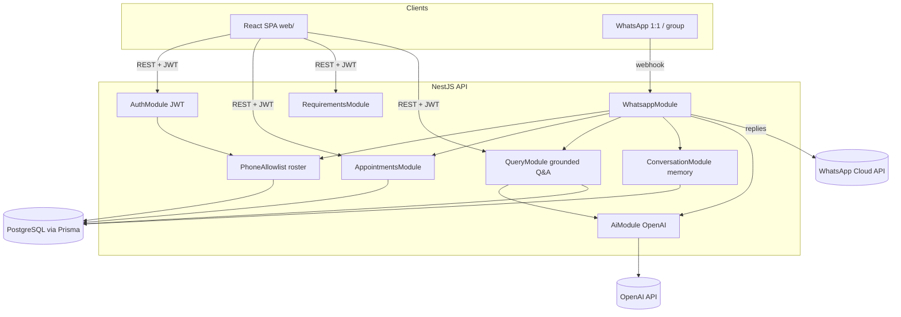
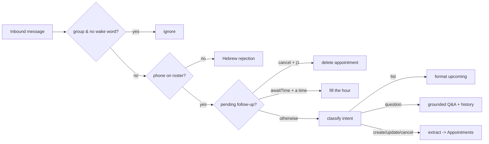

# MedFlowAI — Architecture at a glance

A Hebrew-first assistant for coordinating **one patient's** medical appointments. A small family (≤ ~5 people) adds, updates, cancels, and asks about appointments either from a **web app** or by **WhatsApp message**. Both interfaces hit the **same NestJS backend**, which stores everything in **PostgreSQL** and uses an **LLM** to turn natural Hebrew into structured data and to answer questions grounded strictly in the saved data.

---

## What it does

- **Appointments** — title, date/time, location, prep notes, a checklist (`Requirement`), who drives (`transport`), who's responsible.
- **WhatsApp bot** — natural Hebrew in/out. In a 1:1 chat every message is for the bot; in a group it must be called by the wake word `חנטריש`. It classifies intent (list / question / create / update / cancel) and runs the matching service.
- **Grounded Q&A** — questions are answered only from a JSON snapshot of DB facts (never invented), with short conversation memory so follow-ups like "ומה עם הבא?" work.
- **Web SPA** — login/register, see the next/upcoming appointments, ask the AI, browse the table.
- **Access control** — only phones on the family roster may use either interface.

---

## How it's connected

**Two ways in, one brain:** the web app calls REST endpoints (JWT-protected); WhatsApp arrives via a Meta webhook. Both funnel into the same `AppointmentsService` / `QueryService` / `AiService`, so behavior stays consistent. NestJS modules keep each concern isolated; `PrismaService` is the single DB gateway.

### WhatsApp message flow

---

## The AI layer

The LLM (OpenAI) lives behind `AiService` (`src/ai/`) and is used for two distinct jobs — and never as a database:

- **Extraction (writes):** turn a free Hebrew message ("יש לאבא תור אונקולוגי ב-27.5 באיכילוב") into a structured `Appointment`. The model only proposes fields; the server still owns the truth — dates/times are parsed deterministically from the text, notes are filtered to what was actually said, and `timeKnown` records whether an hour was given.
- **Grounded Q&A (reads):** `QueryService` builds a JSON **facts payload** from the DB (upcoming appointments, and past + counts when the question needs them), and the model is asked to *phrase* an answer **only** from those facts — plus a few recent `ConversationTurn`s so follow-ups have context. It never invents times, drivers, or counts; a Hebrew-only guard strips stray foreign words.

So the AI is a **translator at the edges** (language ⇄ structured data), while PostgreSQL stays the single source of truth. The same `AiService` serves both the WhatsApp bot and the web `/api/query` and `/api/ai/extract` endpoints.

---

## Where the data is stored

Everything lives in one **PostgreSQL** database, modeled in `[prisma/schema.prisma](prisma/schema.prisma)`; all application reads/writes go through Prisma (`PrismaService`).

| Table                    | Holds                                                                                              | Notes                                                              |
| ------------------------ | -------------------------------------------------------------------------------------------------- | ------------------------------------------------------------------ |
| `**FamilyMember`**       | Identity: phone, Hebrew name, gender                                                               | The roster / source of truth for "who is this person"              |
| `**User**`               | Web login (password) linked 1:1 to a `FamilyMember`                                                | Only exists after registration; WhatsApp needs no `User`           |
| `**Appointment**`        | The shared calendar: title, `dateTime` (UTC), `timeKnown`, location, notes, transport, responsible | `timeKnown=false` ⇒ date-only booking; a real 12:00 stays distinct |
| `**Requirement**`        | Per-appointment checklist items                                                                    | Shown in UI + AI facts                                             |
| `**MedicalDocument**`    | File references (`fileUrl` + notes)                                                                | Optional link to an appointment                                    |
| `**UsefulContact**`      | Quick-access numbers: phones (clinic, doctor, taxi) and IDs (ת"ז, member numbers)                  | Editable from web + WhatsApp; in AI facts so "מה המספר של…" works  |
| `**PasswordResetToken**` | Hashed reset codes (WhatsApp OTP)                                                                  | Short-lived                                                        |
| `**ConversationTurn**`   | Recent WhatsApp turns per sender                                                                   | Ephemeral; pruned (TTL + cap) + daily cron                         |
| `**PendingAction**`      | One follow-up the bot is waiting on per sender                                                     | `cancel` (confirm before delete) or `awaitTime` (the missing hour) |

- **Times** are stored in **UTC**; Hebrew formatting uses `Asia/Jerusalem`.
- **No fabricated data:** a booking with no hour is saved date-only (`timeKnown=false`) and the bot **asks** for the time instead of guessing.
- **Access list:** `ALLOWED_PHONE_NUMBERS` (env) only *gates* who may use the app; names/gender live in the `FamilyMember` table.

Full table-by-table notes: `[prisma/schema.prisma](prisma/schema.prisma)`.

---

## Tech stack

| Layer     | Tech                                                         |
| --------- | ------------------------------------------------------------ |
| API       | NestJS (TypeScript), JWT auth                                |
| Data      | PostgreSQL + Prisma ORM (migrations in `prisma/migrations/`) |
| AI        | OpenAI Chat API (extraction + grounded Q&A)                  |
| Messaging | WhatsApp Cloud API (Meta Graph)                              |
| Web       | React + Vite (RTL Hebrew SPA in `web/`)                      |
| Hosting   | Railway (Docker; `prisma migrate deploy` on boot)            |

---

## Where to look in the code

| Concern                                  | Path                   |
| ---------------------------------------- | ---------------------- |
| App wiring / modules                     | `src/app.module.ts`    |
| Auth (register/login/JWT)                | `src/auth/`            |
| Appointments CRUD                        | `src/appointments/`    |
| Checklist                                | `src/requirements/`    |
| Useful numbers                           | `src/contacts/`        |
| Grounded Q&A (DB facts → answer)         | `src/query/`           |
| LLM calls (extraction, Q&A, notes merge) | `src/ai/`              |
| WhatsApp orchestration                   | `src/whatsapp/`        |
| Conversation memory + pending actions    | `src/conversation/`    |
| Roster / allowlist / personas            | `src/phone-allowlist/` |
| DB gateway                               | `src/prisma/`          |
| Schema + migrations                      | `prisma/`              |
| Web SPA                                  | `web/`                 |

Setup, env vars, and the full API surface are in the [`README.md`](README.md). For a longer human-oriented walkthrough, see [`GUIDE.md`](GUIDE.md).