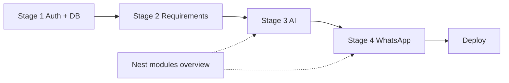

# MedFlow AI — project summaries

These notes are for **first-time readers**: what we built, what was tricky, and why we chose one approach over another. They read like short blog posts with **architecture diagrams**, **code pointers**, and **flow walkthroughs**—not formal specs.

| Topic | File |
|-------|------|
| Nest in plain language + every backend module | [NestJS — technology & modules](nestjs-technology-and-modules.md) |
| Foundation — API, auth, first data model | [Stage 1 — Nest, auth, appointments](stage-1-nest-auth-and-appointments.md) |
| Checklists & “what’s next?” | [Stage 2 — notes, requirements, upcoming](stage-2-notes-requirements-and-upcoming.md) |
| **AI on stored data only** (extraction, Q&A, grounding, update pipeline) | [Stage 3 — AI extraction & grounded Q&A](stage-3-ai-extraction-and-queries.md) |
| WhatsApp in the codebase | [Stage 4 — WhatsApp module](stage-4-whatsapp-module.md) |
| WhatsApp Groups API (OBA, CLI scripts) | [WhatsApp Groups setup](whatsapp-groups-setup.md) |
| Minimal Hebrew UI | [The `web/` SPA](minimal-spa-hebrew-ui.md) |
| Postgres in a box | [Docker & local database](docker-and-local-database.md) |
| Meta’s console (outside the repo) | [Setting up the Meta / WhatsApp app](meta-whatsapp-developer-setup.md) |
| Shipping to the internet | [Deployment — Railway, Dockerfile, SPA](deployment-railway-and-spa.md) |

---

## Suggested onboarding path

**Day 1 — run it locally**

1. [Docker & local database](docker-and-local-database.md) — Postgres up, `.env`, migrate, seed.
2. [Stage 1](stage-1-nest-auth-and-appointments.md) — auth + appointments mental model.
3. [The `web/` SPA](minimal-spa-hebrew-ui.md) — register, see the calendar.

**Day 2 — understand the brain**

4. [NestJS — technology & modules](nestjs-technology-and-modules.md) — module map + dependency graph.
5. [Stage 3 — AI](stage-3-ai-extraction-and-queries.md) — **start here for AI**; extraction vs Q&A, sequence diagrams, file map, notes grounding.
6. [Stage 2](stage-2-notes-requirements-and-upcoming.md) — what the AI reads (`requirements`, `upcoming`).

**Day 3 — WhatsApp + production**

7. [Stage 4 — WhatsApp](stage-4-whatsapp-module.md) — webhook → allowlist → intent → same services as REST.
8. [Meta setup](meta-whatsapp-developer-setup.md) + [Groups](whatsapp-groups-setup.md) if applicable.
9. [Deployment](deployment-railway-and-spa.md) — Railway, env vars, allowlist on prod.

---

## Where to look in code (cheat sheet)

| You want to… | Open |
|--------------|------|
| All OpenAI calls | `src/ai/ai.service.ts` |
| DB → facts → Q&A | `src/query/query.service.ts` |
| WhatsApp webhook + intents | `src/whatsapp/whatsapp.service.ts`, `whatsapp-wake-intent.ts` |
| Anti-hallucination for notes | `src/common/utils/notes-grounding.ts` |
| Hebrew date parsing | `src/common/utils/appointment-datetime.ts` |
| Family phone allowlist | `src/phone-allowlist/phone-allowlist.service.ts` |
| Module wiring | `src/app.module.ts` |

The **application code** lives in the repo; these files are **story + context** so onboarding stays human.
