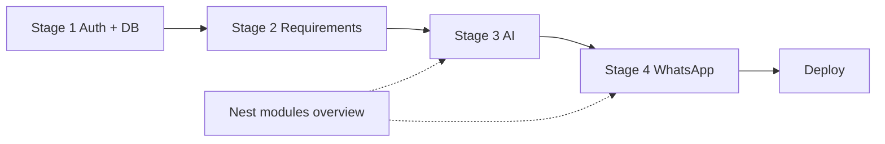

# MedFlow AI — project summaries

These notes are for **first-time readers**: what we built, what was tricky, and why we chose one approach over another. They read like short blog posts with **architecture diagrams**, **code pointers**, and **flow walkthroughs**—not formal specs.

| Topic | File |
|-------|------|
| Nest in plain language + every backend module | [NestJS — technology & modules](nestjs-technology-and-modules.md) |
| Foundation — API, auth, first data model | [Stage 1 — Nest, auth, appointments](stage-1-nest-auth-and-appointments.md) |
| Checklists & “what’s next?” | [Stage 2 — notes, requirements, upcoming](stage-2-notes-requirements-and-upcoming.md) |
| **AI on stored data only** (extraction, Q&A, grounding, update pipeline) | [Stage 3 — AI extraction & grounded Q&A](stage-3-ai-extraction-and-queries.md) |
| WhatsApp in the codebase | [Stage 4 — WhatsApp module](stage-4-whatsapp-module.md) |
| WhatsApp (1:1 family bot) | [Stage 4 — WhatsApp](stage-4-whatsapp-module.md) |
| Minimal Hebrew UI | [The `web/` SPA](minimal-spa-hebrew-ui.md) |
| **Database tables, ER diagram, env vs seed** | [**Database schema & connections**](database-schema-and-connections.md) |
| Postgres in a box | [Docker & local database](docker-and-local-database.md) |
| Meta’s console (outside the repo) | [Setting up the Meta / WhatsApp app](meta-whatsapp-developer-setup.md) |
| Shipping to the internet | [Deployment — Railway, Dockerfile, SPA](deployment-railway-and-spa.md) |

---

## The story in one page (how the stages connect)

If you read the summaries in order, they’re meant to feel like one continuous build:

- **Stage 1** is the “boring backend” foundation: a NestJS API with JWT auth and an `Appointment` table that can survive real family use.
- **Stage 2** turns appointments into **care logistics**: notes + checklists (requirements) and a couple of “what’s next?” queries so the UI and bot can answer quickly.
- **Stage 3** adds AI in a constrained way: the backend stays the source of truth, while the model helps **extract** fields from messy Hebrew text and **phrase** answers from DB facts (with guardrails).
- **Stage 4** adds WhatsApp as another interface: Meta webhook in, intent routing, then the same services as the REST API; short, personalized Hebrew replies out. 1:1 DMs need no wake word, recent turns are remembered for follow-ups, and destructive cancels ask for confirmation first.

Once you have that mental model, the rest of the docs (database schema, Docker, deployment, Meta setup) are just “how to run it” details around the same core.

## Suggested onboarding path

**Day 1 — run it locally**

1. [Docker & local database](docker-and-local-database.md) — Postgres up, `.env`, migrate, seed.
2. [**Database schema & connections**](database-schema-and-connections.md) — `FamilyMember`, `User`, appointments, diagrams.
3. [Stage 1](stage-1-nest-auth-and-appointments.md) — auth + appointments mental model.
4. [The `web/` SPA](minimal-spa-hebrew-ui.md) — register, see the calendar.

**Day 2 — understand the brain**

5. [NestJS — technology & modules](nestjs-technology-and-modules.md) — module map + dependency graph.
6. [Stage 3 — AI](stage-3-ai-extraction-and-queries.md) — **start here for AI**; extraction vs Q&A, sequence diagrams, file map, notes grounding.
7. [Stage 2](stage-2-notes-requirements-and-upcoming.md) — what the AI reads (`requirements`, `upcoming`).

**Day 3 — WhatsApp + production**

8. [Stage 4 — WhatsApp](stage-4-whatsapp-module.md) — webhook → allowlist → intent → same services as REST.
9. [Meta setup](meta-whatsapp-developer-setup.md).
10. [Deployment](deployment-railway-and-spa.md) — Railway, env vars, family roster on prod.

---

## Where to look in code (cheat sheet)

| You want to… | Open |
|--------------|------|
| All OpenAI calls | `src/ai/ai.service.ts` |
| DB → facts → Q&A | `src/query/query.service.ts` |
| WhatsApp webhook + intents | `src/whatsapp/whatsapp.service.ts`, `whatsapp-wake-intent.ts` |
| Conversation memory + confirmations | `src/conversation/conversation.service.ts` |
| Anti-hallucination for notes | `src/common/utils/notes-grounding.ts` |
| Hebrew date parsing | `src/common/utils/appointment-datetime.ts` |
| Family roster + allowlist | `src/phone-allowlist/family-member.service.ts` |
| DB schema overview | [database-schema-and-connections.md](database-schema-and-connections.md) |
| Module wiring | `src/app.module.ts` |

The **application code** lives in the repo; these files are **story + context** so onboarding stays human.
