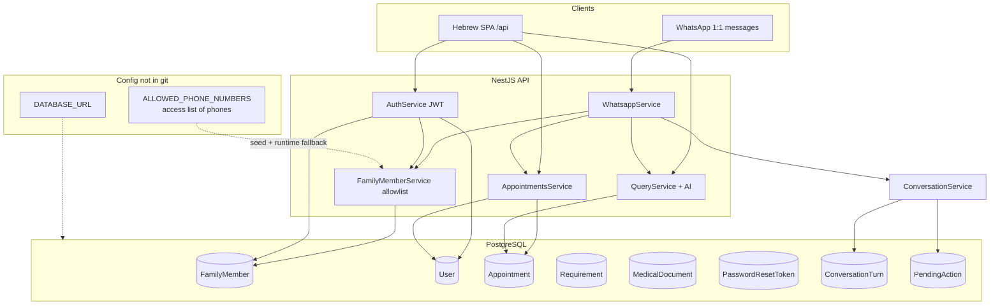
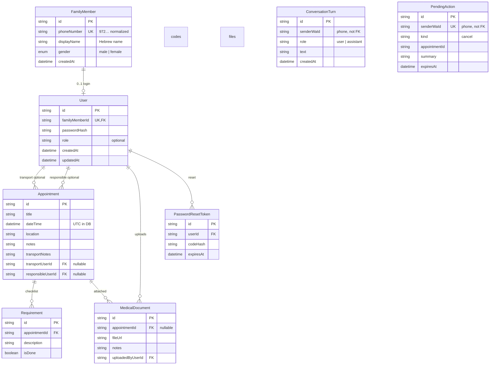
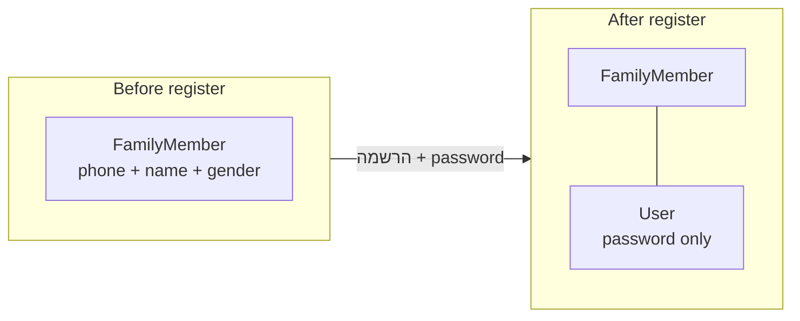
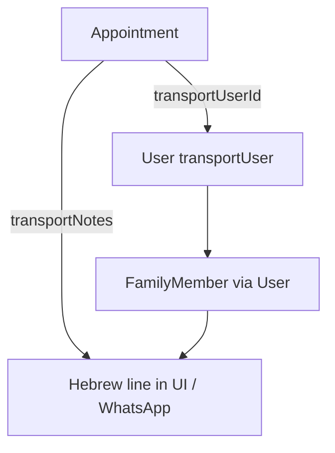
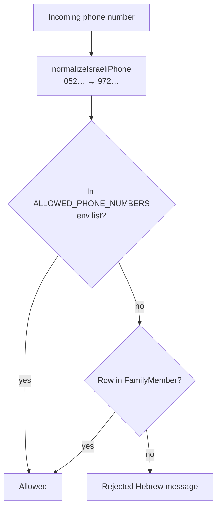
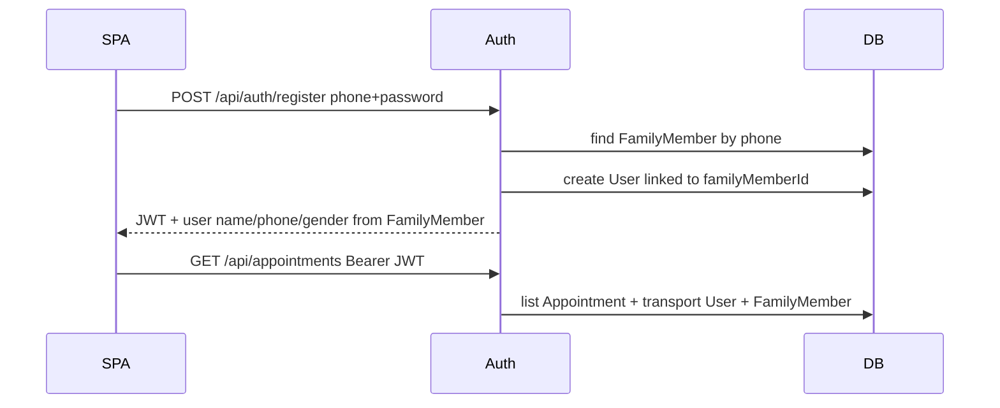
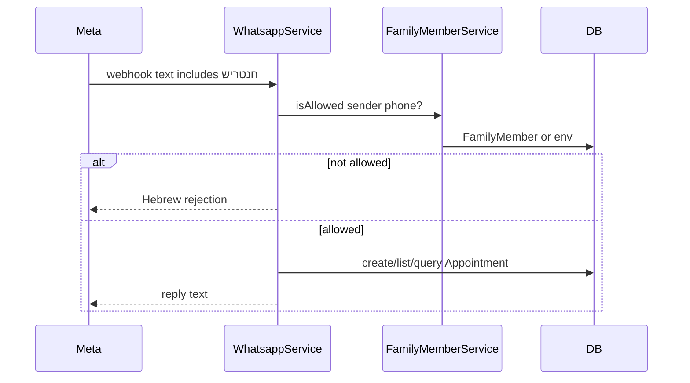

# Database schema & connections — onboarding guide

MedFlowAI stores **family appointments**, **prep checklists**, and **who may use the app** in a single **PostgreSQL** database. The schema is intentionally small: one row per family member for identity, an optional login row, and shared calendar data everyone trusts.

This post explains **what each table is for**, **how they connect**, and **how WhatsApp, the web app, and environment variables** all touch the same data.

---

## The big picture



**Takeaway:** Almost all “who is this person?” data lives on **`FamilyMember`**. **`User`** only adds a password for the website. **`Appointment`** is the shared family calendar.

---

## Entity-relationship diagram



`ConversationTurn` and `PendingAction` are **standalone** (no foreign keys) — they key off the raw WhatsApp sender phone (`senderWaId`), so they work even before someone registers, and a vanished member never orphans rows.

---

## Table-by-table

### `FamilyMember` — the family roster

One row = **one person** the product recognizes by phone.

| Column | Meaning |
|--------|---------|
| `phoneNumber` | Canonical ID for WhatsApp + login (always `972…`, no `+`) |
| `displayName` | Hebrew name shown in UI and AI prompts (e.g. סתיו, אבא) |
| `gender` | Used for Hebrew verb agreement (שירי **תסיע** vs עדי **יסיע**) |

**Who writes here?**

- **Register** — the primary source of `displayName` / `gender`: the signup form's "שם" writes straight to `FamilyMember`.
- **`npm run prisma:seed`** — ensures a row exists per allowlisted phone; only sets `displayName` / `gender` when the env entry actually supplies them (`phone:שם:gender`), and never clobbers an existing name with the phone placeholder.
- **One-time SQL** — `scripts/seed-family-allowlist.sql` for backfilling names on legacy placeholder rows.

**Who reads here?**

- **WhatsApp allowlist** — `FamilyMemberService.isAllowed(phone)` (+ env fallback).
- **AI personas** — `FamilyPersonaService` builds the “known family” block for prompts.
- **Auth responses** — API still returns `name`, `phoneNumber`, `gender` to the SPA, joined from `FamilyMember`.

There is **no separate `AllowedPhone` table** anymore; that was merged into `FamilyMember`.

---

### `User` — web login only

A `User` row exists **only after הרשמה (registration)**. It does **not** duplicate phone, name, or gender.

| Column | Meaning |
|--------|---------|
| `familyMemberId` | Required link to exactly one `FamilyMember` |
| `passwordHash` | bcrypt hash; never sent to the client |
| `role` | Optional string for future admin/coordinator ideas |



**WhatsApp without register:** A family member can message **חנטריש** as soon as they exist in `FamilyMember` (or env allowlist). No `User` row required.

**Cascade:** Deleting a `FamilyMember` deletes their `User` (if any).

---

### `Appointment` — shared calendar

Core fields: `title`, `dateTime`, `location`, `notes`.

| Relation | Purpose |
|----------|---------|
| `transportUserId` → `User` | Registered driver linked by account (e.g. שירי logged in) |
| `transportNotes` | Free text: מונית, תחזיר, times, etc. |
| `responsibleUserId` → `User` | Optional “אחראי” on the web calendar |

Transport display merges **linked user’s** `FamilyMember.displayName` + `gender` with `transportNotes`. If the driver never registered, WhatsApp may store everything in `transportNotes` only.



Times are stored in **UTC**; Hebrew formatting uses `Asia/Jerusalem` in `appointment-datetime.ts`.

---

### `Requirement` — per-appointment checklist

Small tasks tied to one appointment (`description`, `isDone`). Shown in the SPA and included in AI “facts” for grounded Q&A.

---

### `MedicalDocument` — file metadata

Stores `fileUrl` + `notes` + who uploaded (`uploadedByUserId` → `User`). Optional link to an appointment. (Upload pipeline depends on how you host files; the DB only holds references.)

---

### `PasswordResetToken` — forgot-password codes

Short-lived rows with hashed 6-digit codes, sent via WhatsApp OTP flow. Deleted after successful reset.

---

### `ConversationTurn` — short-term WhatsApp memory

One row per message in a 1:1 chat (`role` = `user` | `assistant`, plus `text`). `ConversationService` reads the last ~10 recent turns and threads them into the grounded Q&A LLM call so follow-ups like "ומה עם הבא?" make sense.

| Column | Meaning |
|--------|---------|
| `senderWaId` | WhatsApp phone (the "conversation key", not a FK) |
| `role` | `user` or `assistant` |
| `text` | Raw message text |

**Bloat control:** turns are pruned on every write (TTL + per-sender cap) and a daily `@Cron` sweep deletes anything stale, so this table stays tiny. Indexed on `(senderWaId, createdAt)` for fast recent-turn reads.

---

### `PendingAction` — confirmation for destructive ops

At most **one row per sender** (`senderWaId` is unique). When someone asks to cancel in a DM (no wake word), the bot stores a `PendingAction` instead of deleting, then waits for a `כן`. `consumePendingAction` reads-and-clears it; expired rows (`expiresAt`) are ignored and swept by the same daily cron.

| Column | Meaning |
|--------|---------|
| `kind` | Action type (currently `cancel`) |
| `appointmentId` | Target appointment to delete on confirmation |
| `summary` | Hebrew description echoed back to the user |
| `expiresAt` | After this, the pending action is dead |

---

## Two gates: env vs database



| Mechanism | When it matters |
|-----------|-----------------|
| **`ALLOWED_PHONE_NUMBERS` env** | **Access list only** — who may log in / use the bot; bootstrap before seed; `railway run` seed source |
| **`FamilyMember` table** | **Source of truth** for names, gender, and stable IDs |

**Format (one env var):** bare comma-separated phones are the norm — name and gender belong to the table.

```env
ALLOWED_PHONE_NUMBERS=972521234567,972529876543
# optional bootstrap form (only fills name/gender when present):
ALLOWED_PHONE_NUMBERS=972521234567:שם:female,972529876543:שם2:male
```

- `phone` only → parses to `displayName = null`, `gender = null`. The seed creates a row with the phone as a **placeholder** name, but **never overwrites** an existing name/gender. The real name arrives from **registration** or a one-time table fill.
- `phone:שם:gender` → optional convenience; seed will set/refresh those fields.
- This is deliberate: a bare-phone env used to clobber real names back to the phone number on every seed — now it can't.

**Seed command:** `npm run prisma:seed` upserts into `FamilyMember` (name/gender only when the env entry supplies them). It does **not** run automatically on every Railway deploy—only `prisma migrate deploy` does.

**One-time name fill:** to set names for existing placeholder rows without putting them in env, run `scripts/seed-family-allowlist.sql` (gitignored; copy from `scripts/seed-family-allowlist.example.sql`) — an idempotent table upsert.

---

## How clients use the same tables

### Web (JWT)



### WhatsApp (no JWT)



---

## Migrations & Prisma

| Piece | Location |
|-------|----------|
| Schema truth | `prisma/schema.prisma` |
| SQL history | `prisma/migrations/*` |
| Generated client | `npx prisma generate` |
| Apply locally | `npx prisma migrate dev` |
| Apply production | `npx prisma migrate deploy` (Docker CMD on Railway) |
| Family roster data | `npm run prisma:seed` (manual / `railway run`) |

Important migrations:

- **`20260523120000_family_member_refactor`** — replaced `AllowedPhone` + duplicated `User` profile fields with `FamilyMember` + `User.familyMemberId`.
- **`20260529193000_conversation_memory`** — added `ConversationTurn` + `PendingAction` for WhatsApp conversation memory and destructive-action confirmation.

If a migration **fails** on Railway, Prisma blocks further deploys until you fix the DB and run `prisma migrate resolve`. Recovery scripts live under `scripts/complete-family-migration.sql` (see [Deployment](deployment-railway-and-spa.md)).

---

## Local vs production database

| | Local | Railway |
|---|--------|---------|
| **Host** | `localhost:5434` (Docker) | Postgres plugin URL |
| **Config** | `.env` → `DATABASE_URL` | Service Variables |
| **Family data** | `.env` `ALLOWED_PHONE_NUMBERS` + seed | Same variable on API service + `railway run npm run prisma:seed` |
| **View data** | Prisma Studio, any SQL client | Railway Postgres → Query / Data |

Local and production are **separate databases**. Seeding local does not seed Railway.

---

## Design choices (FAQ)

### Why not one `User` table for everything?

WhatsApp only needs a **phone + name + gender**. Forcing everyone to register would block the bot. Splitting **`FamilyMember`** (identity) from **`User`** (password) matches how the product is used.

### Why is gender only on `FamilyMember`?

Hebrew transport lines and AI prompts need gender per **person**, not per login session. A single place avoids `User.gender` and `AllowedPhone.gender` drifting apart.

### Why `transportUserId` points at `User`, not `FamilyMember`?

Historical and practical: appointments were built around logged-in coordinators. The driver must be a registered user to link cleanly; otherwise the bot keeps plain text in `transportNotes`. Display still resolves the driver’s Hebrew name via `User` → `FamilyMember`.

### What about duplicate phones in the DB?

The app normalizes to `972…` without `+`. Duplicates like `+972…` and `972…` were a common ops issue—seed and cleanup scripts delete `+` rows. Always use normalized numbers in env and SQL.

---

## Code map

| Concern | File |
|---------|------|
| Schema | `prisma/schema.prisma` |
| Seed roster | `prisma/seed.ts`, `src/common/utils/family-roster-env.ts` |
| Allowlist check | `src/phone-allowlist/family-member.service.ts` |
| Personas / transport resolution | `src/phone-allowlist/family-persona.service.ts` |
| API user shape | `src/common/utils/user-profile.ts` |
| Register / login | `src/auth/auth.service.ts` |
| Appointments CRUD | `src/appointments/appointments.service.ts` |
| Facts for AI | `src/query/query.service.ts` |
| Conversation memory + pending actions | `src/conversation/conversation.service.ts` |

---

## Onboarding checklist

1. Start Postgres — [Docker & local database](docker-and-local-database.md)
2. Set `DATABASE_URL`, `JWT_SECRET`, `ALLOWED_PHONE_NUMBERS` in `.env`
3. `npx prisma migrate deploy` then `npm run prisma:seed`
4. Open Prisma Studio or SQL: `SELECT * FROM "FamilyMember";` — expect one row per family member
5. Register in the SPA — creates `User` linked to existing `FamilyMember`
6. Message WhatsApp with **חנטריש** — same allowlist, no `User` required

---

*Index: [summaries/README.md](README.md) · [Nest modules](nestjs-technology-and-modules.md) · [Deployment](deployment-railway-and-spa.md) · [Stage 4 WhatsApp](stage-4-whatsapp-module.md)*
