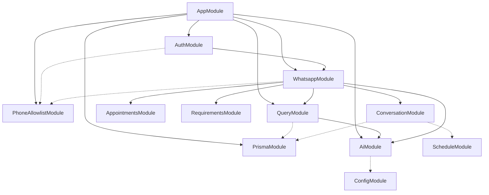
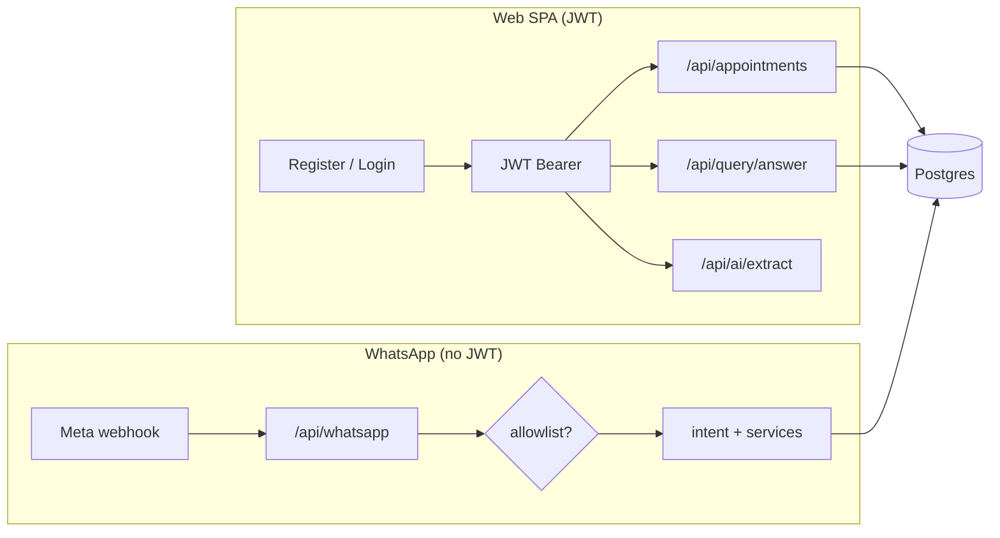

# NestJS — how it is built, why we use it, and what each module does

This note is for anyone who opens `src/` and wants the **big picture**: what Nest is doing under the hood, why it fits MedFlowAI, and how the **feature modules** line up with the product.

---

## How Nest is built (the short version)

**NestJS** is a **Node.js** framework written in **TypeScript**. You describe the app with **decorators** (`@Module`, `@Controller`, `@Injectable`, …) and **classes**. At build time, the Nest CLI compiles everything to plain JavaScript in `dist/`; at runtime, Node runs that output like any other server.

The heart of Nest is **dependency injection (DI)**. You rarely `new` services by hand. Instead you **declare providers** (`@Injectable()` classes) and **inject** them into constructors. Nest’s runtime **wires the graph** once at startup: controllers get services, services get `PrismaService`, and so on. That keeps constructors honest (dependencies are explicit) and makes **testing** easier (swap a fake `AiService` behind the same interface).

Nest also organizes code into **modules**—each module is a bounded chunk: “these controllers, these providers, these imports from other modules.” The **root `AppModule`** lists the modules that should exist in the running app. **Guards** (e.g. JWT) run before route handlers; **pipes** validate and transform incoming bodies (`ValidationPipe` is global in our `main.ts`). **Middleware** and **raw body** hooks sit on the HTTP adapter when we need them (WhatsApp signature verification).

So in one sentence: **TypeScript + decorators + a DI container + modular boundaries + HTTP primitives (guards, pipes, filters)** — that is how Nest is “built” and how we use it.

---

## Why Nest serves *this* project well

MedFlowAI is a **long-lived HTTP API** with:

- **Authenticated JSON routes** for a small team or family (JWT, bcrypt).
- **Postgres** via **Prisma** (typed queries, migrations).
- **Optional AI calls** (OpenAI) that must stay **bounded** (extract structured fields, answer from stored context only).
- A **WhatsApp webhook** that needs **raw request bodies** for HMAC verification and a predictable always-on process.

Nest fits that stack because:

1. **Structure without ceremony** — Each domain (`appointments`, `whatsapp`, …) lives in its own folder with a familiar pattern: module, controller, service, DTOs. New readers know where to look.
2. **Cross-cutting concerns are first-class** — Auth is a guard + strategy, not ad-hoc `if` in every handler. Validation is centralized.
3. **Composition** — `WhatsappModule` imports the pieces it needs (`AiModule`, `QueryModule`, …) instead of one giant “god service.”
4. **One deployable unit** — Same process can serve `/api`, run migrations on boot, and (in Docker) **serve the static UI** from `/` via `@nestjs/serve-static`, which is awkward to replicate cleanly in tiny serverless handlers.

We are not chasing infinite scale here; we want **clarity, safety, and a single place** for API + DB + webhooks. Nest optimizes for that.

---

## What each module does (and how)

Paths below are under `src/`. All **HTTP routes** are prefixed with **`/api`** globally (see `main.ts`), so `AuthController`’s `@Controller('auth')` becomes **`/api/auth/...`**.

### `ConfigModule` (in `app.module.ts`)

**Role:** Load **environment variables** (`.env` locally, Railway’s env in production) into a typed **`ConfigService`** used across the app.

**How:** `ConfigModule.forRoot({ isGlobal: true })` registers it once; any provider can inject `ConfigService` for secrets like `JWT_SECRET`, `DATABASE_URL`, or AI keys without reading `process.env` scattered everywhere.

```22:29:src/phone-allowlist/family-member.service.ts
  getEnvPhones(): string[] {
    const raw = this.config.get<string>('ALLOWED_PHONE_NUMBERS');
    if (!raw?.trim()) {
      return [];
    }
    return phoneNumbersFromRoster(parseAllowedPhoneNumbersEnv(raw));
  }
```

---

### `PrismaModule`

**Role:** Single **database access** layer for the whole app.

**How:** `@Global()` so we do not re-import it in every feature module. It provides **`PrismaService`** (extends Prisma’s generated client, handles connection lifecycle). Services inject `PrismaService` and run queries against **Postgres**. Migrations and schema live in `prisma/`; the client is generated at build time.

```4:16:src/prisma/prisma.service.ts
@Injectable()
export class PrismaService
  extends PrismaClient
  implements OnModuleInit, OnModuleDestroy
{
  async onModuleInit(): Promise<void> {
    await this.$connect();
  }

  async onModuleDestroy(): Promise<void> {
    await this.$disconnect();
  }
}
```

---

### `PhoneAllowlistModule`

**Role:** **Family access control** — only approved phone numbers can register, log in, reset passwords, or talk to the WhatsApp bot.

**How:** Global `@Global()` module exposing **`FamilyMemberService`** and **`FamilyPersonaService`**. Checks **`ALLOWED_PHONE_NUMBERS`** (env access list of phones; optional `:name:gender` bootstrap) **or** rows in **`FamilyMember`** (which owns name/gender). Used by **`AuthService`** (register/login/forgot) and **`WhatsappService.dispatchMessage`**. See [Database schema & connections](database-schema-and-connections.md).

```72:81:src/phone-allowlist/family-member.service.ts
  async isAllowed(phoneInput: string): Promise<boolean> {
    const normalized = this.normalize(phoneInput);
    if (this.getEnvPhones().includes(normalized)) {
      return true;
    }
    const row = await this.prisma.familyMember.findUnique({
      where: { phoneNumber: normalized },
    });
    return row != null;
  }
```

---

### `AuthModule`

**Role:** **Register**, **login**, and everything needed to **issue and validate JWTs**.

**How:** **`AuthController`** exposes `POST /api/auth/register` and `POST /api/auth/login`. **`AuthService`** hashes passwords (bcrypt), creates users, and returns JWTs. **`JwtModule`** is configured asynchronously from `JWT_SECRET` and optional expiry. **`PassportModule`** + **`JwtStrategy`** decode the `Authorization: Bearer` token and attach a **`AuthenticatedUser`** to the request so `@UseGuards(AuthGuard('jwt'))` routes know who is calling.

```216:224:src/auth/auth.service.ts
  private buildAuthResponse(user: Parameters<typeof toPublicUser>[0]) {
    const publicUser = toPublicUser(user);
    const payload: JwtPayload = {
      sub: publicUser.id,
      phoneNumber: publicUser.phoneNumber,
    };
    const access_token = this.jwt.sign(payload);
    return { access_token, user: publicUser };
  }
```

---

### `UsersModule`

**Role:** **Profile** for the logged-in user.

**How:** **`UsersController`** is JWT-protected. `GET /api/users/me` returns the current user; `PATCH /api/users/me` updates allowed fields. **`UsersService`** wraps Prisma reads/updates. This stays intentionally small: no public user directory, just “me.”

```13:21:src/users/users.controller.ts
  @Get('me')
  me(@CurrentUser() user: AuthenticatedUser) {
    return this.users.findOne(user.id);
  }

  @Patch('me')
  updateMe(@CurrentUser() user: AuthenticatedUser, @Body() dto: UpdateUserDto) {
    return this.users.update(user.id, dto);
  }
```

---

### `AppointmentsModule`

**Role:** The **schedule** — each row is an appointment (title, time, location, notes, optional **responsible** user).

**How:** Routes require a **logged-in** user (JWT), but the underlying model is a **shared family-style calendar**: list and detail endpoints return appointments from the database without a separate “only my rows” filter—good enough when everyone who has a login is trusted. **`AppointmentsController`** exposes full CRUD plus **`upcoming`** (from a given date, capped) and **`next`** (single nearest future slot). **`AppointmentsService`** talks to Prisma and validates that IDs exist before updates or deletes.

```22:38:src/appointments/appointments.controller.ts
@Controller('appointments')
@UseGuards(AuthGuard('jwt'))
export class AppointmentsController {
  constructor(private readonly appointments: AppointmentsService) {}

  @Post()
  create(@Body() dto: CreateAppointmentDto) {
    return this.appointments.create(dto);
  }

  @Get('upcoming')
  upcoming(
    @Query('from') from?: string,
    @Query('limit', new DefaultValuePipe(20), ParseIntPipe) limit?: number,
  ) {
    return this.appointments.upcoming(from, limit);
  }
```

---

### `RequirementsModule`

**Role:** **Checklist-style requirements** tied to a **specific appointment** (things to bring, prep steps, done/not done).

**How:** Routes are **nested** under `appointments/:appointmentId/requirements` so URLs match the data shape. **`RequirementsService`** makes sure the **parent appointment exists** before creating, listing, updating, or deleting requirements, and keeps `requirementId` tied to the right `appointmentId` so you cannot patch a requirement “into” the wrong visit by accident.

```10:19:src/requirements/requirements.service.ts
  async create(appointmentId: string, dto: CreateRequirementDto) {
    await this.ensureAppointment(appointmentId);
    return this.prisma.requirement.create({
      data: {
        appointmentId,
        description: dto.description,
        isDone: dto.isDone ?? false,
      },
    });
  }
```

---

### `DocumentsModule`

**Role:** **Medical document records** linked to an appointment: a **URL** (where the file lives — cloud storage, drive link, etc.) plus optional **notes**, and who uploaded it.

**How:** JWT-protected routes under `/api/documents`. **`DocumentsService`** creates rows with **`uploadedByUserId`** set from the current user, optional **`appointmentId`**, **`fileUrl`**, and **`notes`**. List and fetch endpoints return documents **with** related appointment and uploader summaries for the UI; tighten ownership checks later if you need stricter isolation than today’s schema implies.

```34:45:src/documents/documents.service.ts
  async create(userId: string, dto: CreateDocumentDto) {
    const doc = await this.prisma.medicalDocument.create({
      data: {
        appointmentId: dto.appointmentId,
        fileUrl: dto.fileUrl,
        notes: dto.notes ?? '',
        uploadedByUserId: userId,
      },
      include: documentInclude,
    });
    return mapDocument(doc);
  }
```

---

### `AiModule`

**Role:** **All OpenAI HTTP calls** — structured extraction, update reconciliation, notes merge, and grounded Q&A phrasing.

**How:** **`AiController`** exposes `POST /api/ai/extract` (JWT) for debugging. **`AiService`** owns prompts, `JSON.parse`, and post-processing (`mergeWakeAppointmentExtraction`, `filterNotesToSourceText`). It does **not** query Prisma—callers pass text in and get validated fields back. See the full walkthrough with diagrams in [Stage 3 — AI](stage-3-ai-extraction-and-queries.md).

**Key methods:**

| Method | Used by |
|--------|---------|
| `extractAppointmentFromText` | WhatsApp create, `/api/ai/extract` |
| `extractAppointmentUpdateDelta` | WhatsApp update (requirements only) |
| `reconcileAppointmentUpdate` | WhatsApp update (title/location/mergeNotes flag) |
| `mergeAppointmentNotes` | WhatsApp update (companions, transport, prep) |
| `answerQuestionFromFacts` | `QueryService`, WhatsApp questions |

Each method builds a Hebrew system prompt and asks OpenAI for JSON; callers pass text in and get validated fields back:

```67:80:src/ai/ai.service.ts
  async extractAppointmentFromText(
    text: string,
    replyOptions?: PatientReplyOptions,
  ): Promise<WakeAppointmentFields> {
    return this.extractAppointmentFields(text, 'create', replyOptions);
  }

  /** Extract only what the user wants to add or change on an existing appointment. */
  async extractAppointmentUpdateDelta(
    text: string,
    replyOptions?: PatientReplyOptions,
  ): Promise<WakeAppointmentFields> {
    return this.extractAppointmentFields(text, 'update', replyOptions);
  }
```

---

### `QueryModule`

**Role:** **Grounded question answering** — read DB first, then ask the model to phrase a Hebrew answer from a JSON facts blob.

**How:** **`QueryController`** → `POST /api/query/answer`. **`QueryService.buildQnAFactsPayload`** loads upcoming appointments and **expands** to past + keyword counts when the question needs it (history/counting/prep/treatment), then `answerGroundedWithGuard` calls the model and applies a Hebrew-only guard. **`buildUpcomingFactsPayload`** + **`formatFactsDumpHebrew`** format the list **without** an LLM (WhatsApp `חנטריש` alone). Q&A is a **single grounded path** (no intent classifier); the WhatsApp layer also threads short per-sender conversation history via `ConversationService`. Imports **`AiModule`** for `answerQuestionFromFacts`. Details: [Stage 3 walkthrough 2](stage-3-ai-extraction-and-queries.md#walkthrough-2--grounded-qa-conversational).

```184:208:src/query/query.service.ts
  private async answerGroundedWithGuard(
    question: string,
    factsJson: string,
    replyOptions?: PatientReplyOptions,
    history?: ConversationTurnDto[],
  ): Promise<string> {
    let answer = await this.ai.answerQuestionFromFacts(
      question,
      factsJson,
      replyOptions,
      history,
    );
    if (hasDisallowedLatin(answer)) {
      answer = await this.ai.answerQuestionFromFacts(
        question,
        factsJson,
        replyOptions,
        history,
      );
      if (hasDisallowedLatin(answer)) {
        answer = stripDisallowedLatin(answer);
      }
    }
    return answer;
  }
```

---

### `WhatsappModule`

**Role:** **Meta WhatsApp Cloud API** — webhook verification, inbound messages, conversational orchestration.

**How:** **`WhatsappController`** is **not** JWT-protected. **`WhatsappService`** verifies HMAC, gates on **allowlist only** (no web registration required for WhatsApp), then gates the **wake word by chat type** — required only in group chats, skipped in 1:1 DMs. It classifies intent (`whatsapp-wake-intent.ts`) and delegates to **`AppointmentsService`**, **`QueryService`**, **`AiService`**. Replies are **personalized** (sender name + gendered Hebrew), destructive cancels go through a **confirmation** step, and recent turns are pulled from **`ConversationService`** for follow-ups. End-to-end flow diagram: [Stage 4](stage-4-whatsapp-module.md).

```145:154:src/whatsapp/whatsapp.service.ts
    const text = message.text.trim();
    if (!text) {
      return;
    }

    const hadWakeWord = containsWakeWord(text);
    // In group chats the bot must be called by name; in 1:1 DMs every message is for it.
    if (message.replyTo.type === 'group' && !hadWakeWord) {
      return;
    }
```

---

### `ConversationModule`

**Role:** **Short-term WhatsApp memory + pending confirmations** — lets the bot handle follow-up questions and confirm destructive actions.

**How:** Provides **`ConversationService`**, which stores per-sender **`ConversationTurn`** rows (threaded into Q&A) and at most one **`PendingAction`** per sender (a cancel awaiting `כן`). Writes prune aggressively (TTL + per-sender cap) and a daily **`@Cron`** sweep (via `ScheduleModule`) clears stale rows, so Postgres stays small. Imported by `WhatsappModule`. See [Database schema](database-schema-and-connections.md#conversationturn--short-term-whatsapp-memory).

```30:45:src/conversation/conversation.service.ts
  async getRecentTurns(
    senderWaId: string,
    opts?: { ttlMinutes?: number; limit?: number },
  ): Promise<ConversationTurnDto[]> {
    const ttlMinutes = opts?.ttlMinutes ?? DEFAULT_TURN_TTL_MINUTES;
    const limit = opts?.limit ?? 6;
    const cutoff = new Date(Date.now() - ttlMinutes * 60 * 1000);
    const rows = await this.prisma.conversationTurn.findMany({
      where: { senderWaId, createdAt: { gte: cutoff } },
      orderBy: { createdAt: 'desc' },
      take: limit,
    });
    return rows
      .reverse()
      .map((r) => ({ role: r.role as ConversationRole, text: r.text }));
  }
```

---

### `AppModule` (the root)

**Role:** **Wiring diagram** — turns on global config, database, every feature module, and (when **`client/index.html`** exists in production) **static SPA** hosting for `/` while **`/api/...`** stays the API.

**How:** A single `@Module({ imports: [...] })` list. Order matters for static files: **feature modules first**, **`ServeStaticModule`** last so API routes win for `/api` and the SPA fallback handles client-side routes.

```17:34:src/app.module.ts
@Module({
  imports: [
    ConfigModule.forRoot({ isGlobal: true }),
    ScheduleModule.forRoot(),
    PrismaModule,
    PhoneAllowlistModule,
    AuthModule,
    UsersModule,
    AppointmentsModule,
    RequirementsModule,
    DocumentsModule,
    AiModule,
    QueryModule,
    ConversationModule,
    WhatsappModule,
  ],
  controllers: [RootController],
})
```

---

## Module dependency graph

Who imports whom (solid = explicit `imports:` in module file; dashed = global inject):



**Notable coupling:** `AuthModule` imports `WhatsappModule` for password-reset OTP over WhatsApp—not the other way around.

---

## Request paths (two front doors)



Both paths call the **same services** for appointments and AI—only the adapter differs.

```text
HTTP request
    → global prefix /api (except static / from Docker)
    → guards (JWT where applied)
    → controller
    → service(s) + Prisma / OpenAI / WhatsApp helpers
    → JSON (or challenge string for webhook verify)
```

If you remember only one thing: **modules are boundaries**, **services hold behavior**, **controllers are thin HTTP adapters**, and **Prisma + Config + Auth** are the shared foundation everything else stands on.

For a **deep dive on AI flows** (extraction, Q&A, notes grounding, WhatsApp update pipeline), read [Stage 3 — AI](stage-3-ai-extraction-and-queries.md) next.

---

*Index: [summaries/README.md](README.md)*
