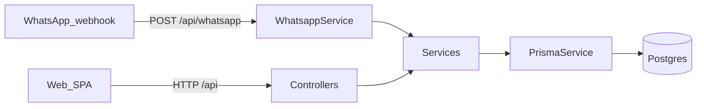

# Stage 1 — Nest, auth, and the core data model

If you’re opening this project for the first time, **Stage 1** is the spine: a small API that can authenticate family members and store appointments for one father figure—no hospital ERP fantasy, just something a sibling group can actually run.

## The backend story (in plain language)

At its core, MedFlowAI is a **single backend service** (NestJS) that sits behind every interface you use:

- The **web UI** (the Hebrew `web/` SPA) calls the backend over HTTP (`/api/...`) after you log in.
- The **WhatsApp bot** also calls the same backend code: WhatsApp messages arrive via a webhook, then the backend turns them into the same create/update/cancel operations.
- The database is the source of truth. The LLM (when enabled in later stages) can help **extract** fields from messy text, but the backend still owns validation and persistence.

If you’re familiar with “controllers/services”, this codebase keeps that separation clean:

- **Controllers** expose HTTP endpoints (they don’t contain business logic).
- **Services** implement the business logic and are reusable (REST + WhatsApp share them).
- **Prisma** is the only way we touch Postgres (no raw SQL sprinkled throughout the app).

### A quick mental model

### What the backend “serves”

In Stage 1 the backend’s responsibilities are intentionally boring and reliable:

- **Auth**: register/login with phone+password, return JWT, protect write endpoints.
- **Appointments**: CRUD an appointment row with the few fields a family actually uses:
  title, date/time, location, notes, and optional “who’s responsible”.
- **Validation**: reject bad input early with friendly Hebrew messages where the user sees them.

The rest of the project (Stages 2–4) builds on that same backbone rather than replacing it.

## Routes and the services behind them

Everything below is served under the global **`/api`** prefix (see `src/main.ts`). You can think of each route group as a small “feature”, backed by a Nest **service**:

### Auth (`src/auth/`)

- **`POST /api/auth/register`** → create a user and return a JWT  
  - **Controller**: `src/auth/auth.controller.ts`  
  - **Service**: `src/auth/auth.service.ts`
- **`POST /api/auth/login`** → validate password and return a JWT  
- **`POST /api/auth/forgot-password`** / **`POST /api/auth/reset-password`** → optional password reset flow (later stages also integrate with WhatsApp OTP templates)

### Appointments (`src/appointments/`)

All appointment routes are JWT-protected (`AuthGuard('jwt')`):

- **`POST /api/appointments`** → create an appointment
- **`GET /api/appointments`** → list all appointments
- **`GET /api/appointments/:id`** → get one
- **`PATCH /api/appointments/:id`** → update
- **`DELETE /api/appointments/:id`** → delete
- **`GET /api/appointments/next`** → convenience: the next upcoming appointment
- **`GET /api/appointments/upcoming?from=<iso>&limit=<n>`** → list from a point in time

Behind these endpoints:

- **Controller**: `src/appointments/appointments.controller.ts`
- **Service**: `src/appointments/appointments.service.ts` (the single place that talks to Prisma for appointment rows)

### Requirements (checklists) (`src/requirements/`)

Stage 2 adds checklists (“what to bring / what to do”). Routes are nested under a specific appointment:

- **`POST /api/appointments/:appointmentId/requirements`** → add a checklist item
- **`GET /api/appointments/:appointmentId/requirements`** → list checklist items
- **`PATCH /api/appointments/:appointmentId/requirements/:requirementId`** → mark done / edit
- **`DELETE /api/appointments/:appointmentId/requirements/:requirementId`** → remove

Behind these endpoints:

- **Controller**: `src/requirements/requirements.controller.ts`
- **Service**: `src/requirements/requirements.service.ts`

### User profile (`src/users/`)

- **`GET /api/users/me`** → current user
- **`PATCH /api/users/me`** → update basic profile info

Behind these endpoints:

- **Controller**: `src/users/users.controller.ts`
- **Service**: `src/users/users.service.ts`

### Documents (`src/documents/`)

Stage 1 also includes a small “documents” area for uploading/recording items (so families can keep a few key PDFs/notes in the same system):

- **`POST /api/documents`** → create a document entry (JWT)
- **`GET /api/documents`** → list documents (JWT)
- **`GET /api/documents/:id`** → fetch one (JWT)

Behind these endpoints:

- **Controller**: `src/documents/documents.controller.ts`
- **Service**: `src/documents/documents.service.ts`

### AI and grounded Q&A (`src/ai/`, `src/query/`)

Stage 3 adds AI in two narrow roles:

- **Extraction** (structured JSON): **`POST /api/ai/extract`** (debugging/tooling)  
  - `src/ai/ai.controller.ts` → `src/ai/ai.service.ts`
- **Grounded answers** from saved data: **`POST /api/query/answer`**  
  - `src/query/query.controller.ts` → `src/query/query.service.ts`

### WhatsApp webhook (`src/whatsapp/`)

Stage 4 adds the Meta WhatsApp Cloud API integration:

- **`GET /api/whatsapp`** → Meta webhook verification handshake
- **`POST /api/whatsapp`** → inbound messages (WhatsApp → your server)

Behind these endpoints:

- **Controller**: `src/whatsapp/whatsapp.controller.ts`
- **Service**: `src/whatsapp/whatsapp.service.ts`

The key point: the WhatsApp service ultimately calls the same appointment services as the REST API, so you’re not maintaining two separate “business logic” systems.

## What we built

- **NestJS** in TypeScript, with a global **`/api`** prefix so all routes stay grouped and predictable.
- **Prisma + PostgreSQL** for persistence. The first schema had only what mattered: **`User`** (name, unique phone, optional role, password hash) and **`Appointment`** (title, time, location, notes, optional responsible user).
- **JWT authentication** after register/login with **phone + password**—chosen so the same identifier could later line up with WhatsApp sender IDs without inventing a parallel “email world.”
- **bcrypt** for password hashing, with a documented cost factor in line with common practice.
- **class-validator** on DTOs so bad input fails fast with **Hebrew** messages where the user sees them; code and database stay in English.
- A **seed script** with realistic Hebrew names and appointment copy (hospitals, forms, that kind of family logistics).

## Challenges along the way

- **Node and Prisma versions.** Newer Prisma releases wanted a newer minimum Node version than some developers had installed. Rather than force everyone to upgrade Node immediately, we **pinned Prisma 5.x**, which still behaves like the Prisma you’ll see in most tutorials and runs comfortably on common Node 20 installs.
- **Keeping the model boring on purpose.** It’s tempting to add `Patient`, `Clinic`, `Specialty`, enums everywhere. We resisted: one implicit patient, free-text fields, optional `role` string only. That keeps migrations and mental load small for a 30-day learning project that still has to *work*.

## Why these choices (and not others)

| Choice | Instead of… | Because |
|--------|----------------|----------|
| Phone + JWT | Email-only auth | WhatsApp and family coordination already revolve around phone numbers. |
| Single `Appointment` entity | Rich scheduling subsystem | The product question was “when / where / what to bring?”—not “optimize OR utilization.” |
| Hebrew in validation/errors only | Hebrew variable names | Tooling, diffs, and international collaborators stay easier; UX stays local. |
| Prisma | Raw SQL or a heavier ORM | Fast iteration, type-safe queries, easy seeds—good fit for a small team codebase. |

## What we deliberately did *not* build yet

Refresh tokens, fine-grained RBAC, multi-tenant clinics, audit logs for every read—those belong to a different product phase. Stage 1 was about **credibility**: you can register, log in, and CRUD appointments against a real database.

---

*Next in this series: [Stage 2 — notes, requirements, and “what’s next?”](stage-2-notes-requirements-and-upcoming.md)*
