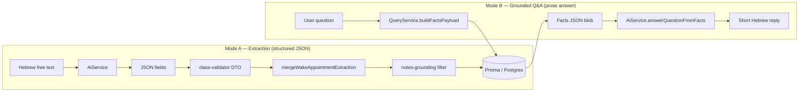
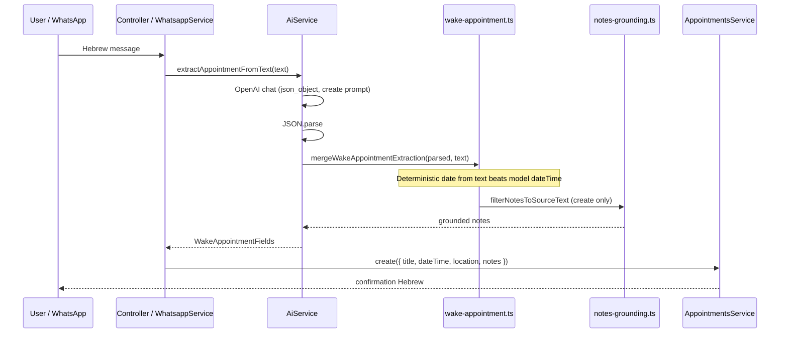
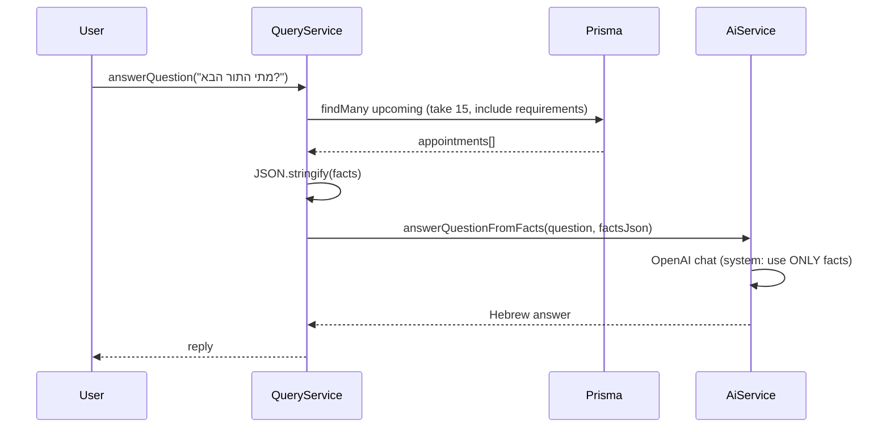
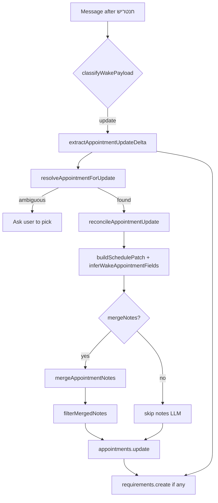

# Stage 3 — AI extraction and grounded questions

By Stage 3, the database already “knows” things. **AI** is not there to invent medical facts—it’s there to **turn messy Hebrew messages into structured rows** and to **phrase answers** from what’s already stored, in natural short Hebrew.

This note walks you through **where the code lives**, **how data flows**, and **why we added extra guardrails** (especially around notes).

## The backend story: AI as a helper, not the source of truth

The key mindset shift is: the model is **not** “the system”. The backend stays responsible for:

- **Reading and writing the database** (Prisma + Postgres).
- **Validation** (DTOs + `class-validator`).
- **Deterministic parsing** where it matters (dates/times in Israel/Jerusalem).
- **Guardrails** against hallucinations (especially in notes).

AI is a dependency that:

- turns free text into **structured fields** (so WhatsApp can “write”),
- and turns a JSON snapshot of saved data into **short Hebrew answers** (so WhatsApp/web can “read”).

### Stage 3 routes (what you can call)

Everything below is under `/api` and is JWT-protected:

- **`POST /api/query/answer`** — grounded Q&A (reads DB facts, model only phrases)  
  - `src/query/query.controller.ts` → `src/query/query.service.ts` → `src/ai/ai.service.ts`
- **`POST /api/ai/extract`** — extraction for debugging/tools (turn text → fields)  
  - `src/ai/ai.controller.ts` → `src/ai/ai.service.ts`

WhatsApp uses the same services internally (it doesn’t need a separate endpoint).

---

## The big idea in one diagram

MedFlowAI uses the LLM in **two different modes**. They share `AiService`, but the contract is different:



| Mode | Input | Output | Who calls it |
|------|--------|--------|--------------|
| **Extraction** | “לאבא יש תור ב-27.5 באיכילוב” | `{ title, dateTime, location, notes, requirements[] }` | WhatsApp create/update, `POST /api/ai/extract` |
| **Grounded Q&A** | “מתי התור הבא?” | Plain Hebrew string | SPA, WhatsApp questions, `POST /api/query/answer` |

**Rule of thumb:** extraction **writes** the DB; Q&A **reads** the DB first, then asks the model to **phrase** an answer from a JSON snapshot.

---

## Module layout (files to open first)

```text
src/
├── ai/
│   ├── ai.module.ts              # exports AiService
│   ├── ai.controller.ts          # POST /api/ai/extract (JWT, debugging)
│   ├── ai.service.ts             # all OpenAI chat calls
│   ├── wake-appointment.ts       # merge model JSON + deterministic date parsing
│   ├── ai-validation.ts          # class-validator after JSON.parse
│   ├── appointment-update-reconcile.ts
│   ├── notes-merge.ts
│   └── dto/extraction-result.dto.ts
├── query/
│   ├── query.module.ts           # imports AiModule
│   ├── query.controller.ts       # POST /api/query/answer (JWT)
│   └── query.service.ts          # buildFactsPayload + formatFactsDumpHebrew
└── common/utils/
    ├── notes-grounding.ts        # post-LLM anti-hallucination for notes
    ├── appointment-datetime.ts   # Israel/Jerusalem date parsing
    └── wake-appointment-fields.ts
```

`QueryModule` **imports** `AiModule` but owns the **database read** (`buildFactsPayload`). `AiService` never touches Prisma directly—it only sees strings (user text, facts JSON).

---

## Walkthrough 1 — Create extraction (HTTP or WhatsApp)

### Step-by-step



### What `AiService` actually sends

Create mode uses a **strict system prompt**: extract title, location, notes, requirements—but **not** `dateTime` (the server parses dates from the raw Hebrew text instead, which is more reliable for `27.5`, “יום חמישי”, etc.).

After the model returns, three layers run **before** anything hits Postgres:

1. **`JSON.parse`** — bad JSON → Hebrew 503, not a corrupt row.
2. **`validateAppointmentExtraction`** — `class-validator` on `AppointmentExtractionResultDto`.
3. **`mergeWakeAppointmentExtraction`** — merges model fields with **`parseAppointmentWhenFromText`** (Jerusalem timezone, explicit-time detection).

Relevant entry point:

```51:95:src/ai/ai.service.ts
  async extractAppointmentFromText(text: string): Promise<WakeAppointmentFields> {
    return this.extractAppointmentFields(text, 'create');
  }
  // ...
  private async extractAppointmentFields(
    text: string,
    mode: 'create' | 'update',
  ): Promise<WakeAppointmentFields> {
    // ... OpenAI call with mode-specific system prompt ...
    const merged = mergeWakeAppointmentExtraction(parsed, text);
    if (mode === 'create' && merged.notes?.trim()) {
      merged.notes = filterNotesToSourceText(merged.notes, text);
    }
    return merged;
  }
```

Date merge logic (model vs regex):

```14:44:src/ai/wake-appointment.ts
/** Merge model output with deterministic Israel date/time parsing from the raw text. */
export function mergeWakeAppointmentExtraction(
  raw: unknown,
  sourceText: string,
  now = new Date(),
): WakeAppointmentFields {
  const dto = validateAppointmentExtraction(raw);
  const parsed = parseAppointmentWhenFromText(sourceText, now);

  if (parsed) {
    dto.dateTime = parsed.dateTime;
    return { ...dto, hasTime: parsed.hasTime };
  }
  // ... fallback if only model returned dateTime ...
}
```

### Try it yourself (JWT required)

```http
POST /api/ai/extract
Authorization: Bearer <token>
Content-Type: application/json

{ "text": "לאבא יש תור ב-27.5 בביקורת קרדיו באיכילוב, להביא תוצאות דם" }
```

Use this route when debugging prompts without sending WhatsApp messages.

---

## Walkthrough 2 — Grounded Q&A

### Step-by-step



Facts payload shape (what the model is allowed to “see”):

```13:48:src/query/query.service.ts
  async buildFactsPayload() {
    const now = new Date();
    const upcoming = await this.prisma.appointment.findMany({
      where: { dateTime: { gte: now } },
      orderBy: { dateTime: 'asc' },
      take: 15,
      include: {
        requirements: true,
        responsibleUser: { select: { name: true, phoneNumber: true } },
      },
    });
    return {
      generatedAt: now.toISOString(),
      upcomingAppointments: upcoming.map((a) => ({
        id: a.id,
        title: a.title,
        dateTime: a.dateTime.toISOString(),
        location: a.location,
        notes: a.notes,
        responsible: a.responsibleUser,
        requirements: a.requirements.map((r) => ({
          description: r.description,
          isDone: r.isDone,
        })),
      })),
    };
  }

  async answerQuestion(question: string) {
    const facts = await this.buildFactsPayload();
    const factsJson = JSON.stringify(facts, null, 0);
    return this.ai.answerQuestionFromFacts(question, factsJson);
  }
```

**Important:** `formatFactsDumpHebrew` lists appointments **without** calling the LLM—used when someone sends only `חנטריש` on WhatsApp (see Stage 4).

System prompt for Q&A (note the “ONLY facts” constraint):

```199:218:src/ai/ai.service.ts
  async answerQuestionFromFacts(question: string, factsJson: string) {
  // ...
        {
          role: 'system',
          content: `You answer questions in Hebrew only. Use ONLY the facts JSON in FACTS ...`,
        },
        {
          role: 'user',
          content: `FACTS:\n${factsJson}\n\nשאלה:\n${question}`,
        },
```

---

## Walkthrough 3 — Update flow (WhatsApp only, richest AI path)

Updates are **not** a single extraction call. WhatsApp’s `handleWakeUpdate` orchestrates **deterministic matching**, **up to three LLM calls**, and **non-AI patch building**:



| Step | Function | LLM? | Purpose |
|------|----------|------|---------|
| 1 | `extractAppointmentUpdateDelta` | Yes | New checklist items only (update mode skips notes in prompt) |
| 2 | `resolveAppointmentForUpdate` | No | Match by date strings, clinic name, “most recent” fallback |
| 3 | `reconcileAppointmentUpdate` | Yes | Fix generic title/location; set `mergeNotes` flag |
| 4 | `buildSchedulePatch` | No | Change time **only** if user explicitly said so |
| 5 | `mergeAppointmentNotes` | Yes | Merge companions/transport/prep lines intelligently |
| 6 | `filterMergedNotes` | No | Drop new sentences not grounded in user message |

Update orchestration in WhatsApp layer:

```234:336:src/whatsapp/whatsapp.service.ts
  private async handleWakeUpdate(payload: string): Promise<string> {
  // ...
    const extracted = await this.ai.extractAppointmentUpdateDelta(payload);
    const lookup = await this.resolveAppointmentForUpdate(payload);
  // ...
    const reconciled = await this.ai.reconcileAppointmentUpdate(/* existing */, payload);
    const { patch: schedulePatch } = buildSchedulePatch(payload, target);
  // ...
    if (shouldMergeNotes) {
      const merged = await this.ai.mergeAppointmentNotes(target.notes ?? '', payload);
      // ...
    }
    const updated = await this.appointments.update(target.id, patch);
```

---

## Notes grounding — why it exists

Models love to invent **transport** (“מונית”, “רכב פרטי”) when coordinating medical visits. We filter **after** the LLM, using the **original user message** as ground truth:

```16:38:src/common/utils/notes-grounding.ts
export function sentenceGroundedInSource(
  sentence: string,
  sourceText: string,
): boolean {
  // ...
  if (TRANSPORT_RE.test(s) && !TRANSPORT_RE.test(sourceText)) {
    return false;
  }
  // word-overlap threshold ...
}
```

Two hooks:

| Hook | When | Behavior |
|------|------|----------|
| `filterNotesToSourceText` | After **create** extraction | Drop note sentences not supported by user text |
| `filterMergedNotes` | After **merge** extraction | Keep existing DB lines; new lines must pass grounding check |

This is **defense in depth** alongside strict prompts in `AiService`—prompts reduce errors; grounding catches stragglers.

---

## Configuration

| Env var | Role |
|---------|------|
| `OPENAI_API_KEY` | Required for AI routes; missing → Hebrew 503 |
| `OPENAI_MODEL` | Default `gpt-4o-mini` |
| `OPENAI_BASE_URL` | Optional; any OpenAI-compatible API |
| `PATIENT_NAME` | Hebrew label in prompts (default: “אבא (מטופל יחיד)”) |

No `AiInteraction` audit table yet—add one if production debugging becomes painful.

---

## Tests (what CI actually covers)

| File | What it proves |
|------|----------------|
| `src/ai/ai-validation.spec.ts` | DTO rejects bad extraction shapes |
| `src/query/query.service.spec.ts` | Facts builder + wiring (mocked `AiService`) |
| `src/common/utils/notes-grounding.spec.ts` | Transport hallucinations dropped |

**No live OpenAI calls in unit tests**—mock the client or inject a fake `AiService`.

---

## Design choices (short)

| Choice | Instead of… | Because |
|--------|-------------|---------|
| Two-step Q&A (DB → then LLM phrasing) | Agent that queries SQL | Simpler, cheaper, fewer failure modes |
| JSON + DTO validation | Trust model output | Safe Prisma writes |
| Server-side date parsing | Model returns ISO datetime | Hebrew dates are ambiguous; regex + Jerusalem TZ is predictable |
| Separate create/update/reconcile/merge prompts | One mega-prompt | Each step has a narrow job; easier to tune |
| Post-LLM notes grounding | Prompt-only | Family app cannot afford invented drivers |

## What we did not build

Tool loops, RAG over PDFs, multi-step planners—these are great for other products; here they would mostly **delay shipping** something the family can use tonight.

---

*Previous: [Stage 2](stage-2-notes-requirements-and-upcoming.md) · Next: [Stage 4 — WhatsApp](stage-4-whatsapp-module.md)*
