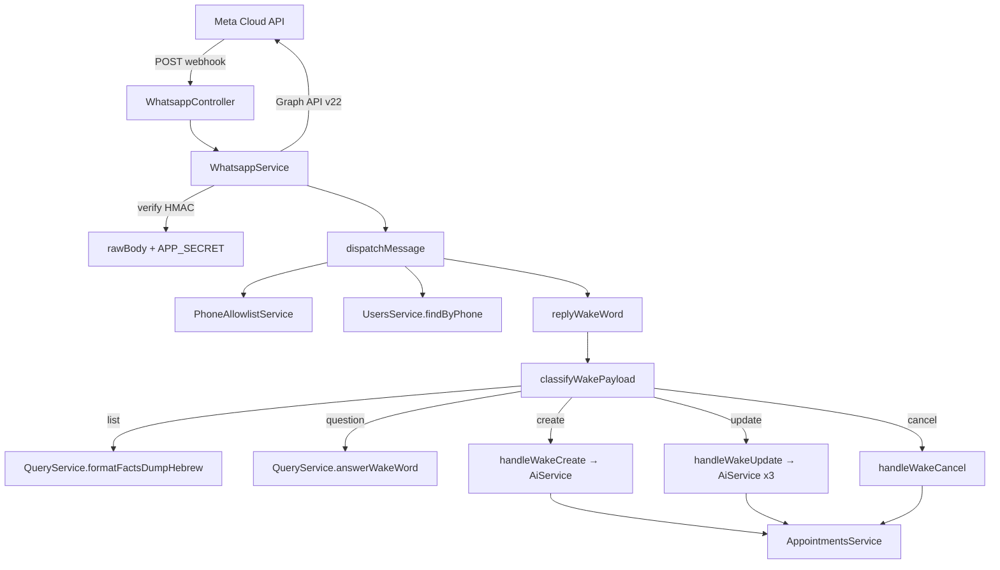
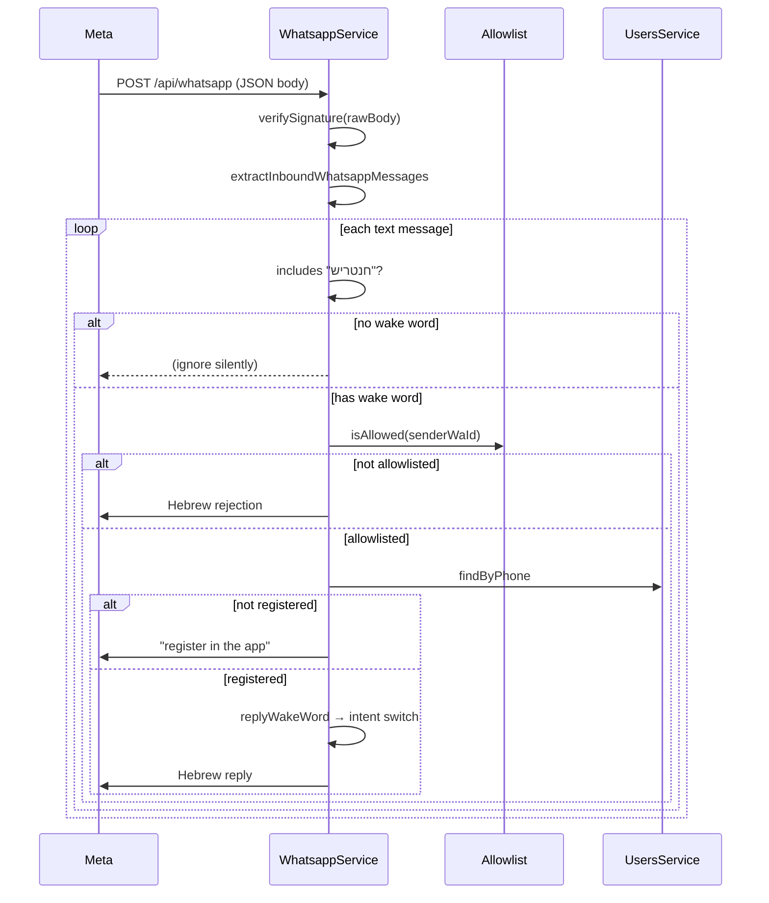

# Stage 4 — WhatsApp as “just another interface”

WhatsApp isn’t a separate product—it’s **the same brain** as the REST API, with a thinner adapter: parse Meta’s webhook, decide intent, call existing services, reply in short Hebrew.

This note focuses on **end-to-end message flow**, how it connects to **Stage 3 AI**, and the **security gates** before any bot logic runs.

---

## Architecture at a glance



**Imports in `WhatsappModule`:** `AiModule`, `QueryModule`, `AppointmentsModule`, `RequirementsModule`, `UsersModule` — business rules stay in those services; WhatsApp is orchestration only.

---

## Inbound pipeline (every message)



Entry points in code:

```105:158:src/whatsapp/whatsapp.service.ts
  async handleWebhookPayload(/* ... */) {
    this.verifySignature(rawBody, signature);
    // ...
    for (const m of messages) {
      await this.dispatchMessage(m).catch(/* ... */);
    }
    return { status: 'ok' };
  }

  private async dispatchMessage(message: { /* ... */ }) {
    if (!text.includes(BOT_WAKE_WORD)) {
      return;
    }
    if (!(await this.allowlist.isAllowed(message.senderWaId))) {
      await this.safeSend(message.replyTo, PHONE_NOT_ON_ALLOWLIST_HE);
      return;
    }
    const user = await this.users.findByPhone(message.senderWaId);
    if (!user) {
      await this.safeSend(message.replyTo, PHONE_NOT_REGISTERED_WHATSAPP_HE);
      return;
    }
    await this.replyWakeWord(message.replyTo, text);
  }
```

**Wake word:** `חנטריש` (`BOT_WAKE_WORD`). Messages without it are ignored—important for group chats where the bot should not reply to every family message.

---

## Intent routing (after stripping the wake word)

`classifyWakePayload` in `whatsapp-wake-intent.ts` uses **Hebrew regex heuristics** (not a second ML model):

```110:131:src/whatsapp/whatsapp-wake-intent.ts
export function classifyWakePayload(payload: string): WakeIntent {
  if (!payload) {
    return 'list';
  }
  if (CANCEL_RE.test(payload)) {
    return 'cancel';
  }
  if (looksLikeNewAppointment(payload)) {
    return 'create';
  }
  if (looksLikeAppointmentUpdate(payload)) {
    return 'update';
  }
  if (looksLikeQuestion(payload)) {
    return 'question';
  }
  if (DATE_HINT_RE.test(payload)) {
    return 'create';
  }
  return 'question';
}
```

| Intent | Example (include `חנטריש`) | Services used | LLM calls |
|--------|----------------------------|---------------|-----------|
| **list** | `חנטריש` alone | `QueryService.buildFactsPayload` + `formatFactsDumpHebrew` | **0** |
| **question** | `חנטריש מתי התור הבא?` | `QueryService.answerWakeWord` | 1 (grounded Q&A) |
| **create** | `חנטריש, לאבא יש תור ב-27.5…` | `AiService.extractAppointmentFromText` → `AppointmentsService.create` | 1 (extract) |
| **update** | `חנטריש תעדכן שהתור ב-30.7 בשעה 9:30` | See [Stage 3 update walkthrough](stage-3-ai-extraction-and-queries.md#walkthrough-3--update-flow-whatsapp-only-richest-ai-path) | up to **3** |
| **cancel** | `חנטריש תבטל את התור ב-27.5` | Extract date → delete matching day | 1 (date via extract) |

Intent switch in `WhatsappService`:

```160:194:src/whatsapp/whatsapp.service.ts
  private async replyWakeWord(replyTo: WhatsappSendTarget, text: string) {
    const payload = stripWakeWord(text);
    const intent = classifyWakePayload(payload);
    switch (intent) {
      case 'list':
        await this.safeSend(replyTo, this.query.formatFactsDumpHebrew(
            await this.query.buildFactsPayload()));
        return;
      case 'question':
        await this.safeSend(replyTo, await this.query.answerWakeWord(text));
        return;
      // cancel, create, update ...
    }
  }
```

---

## What we built (checklist)

- **`GET /api/whatsapp`** — Meta verification; `hub.verify_token` must match **`WHATSAPP_VERIFY_TOKEN`**.
- **`POST /api/whatsapp`** — inbound Cloud API payloads; **HMAC** on `X-Hub-Signature-256` when **`WHATSAPP_APP_SECRET`** is set. Nest boots with **`rawBody: true`** so signature verification uses raw bytes.
- **Allowlist + registration gate** — sender must be in `AllowedPhone` / `ALLOWED_PHONE_NUMBERS` **and** have a `User` row (same phone).
- **Full CRUD-style intents** — create, update (with appointment matching), cancel, list, Q&A—not “always create” anymore.
- **Outbound** — Graph API **`v22.0`** when tokens are set; otherwise log `[WhatsApp לא מוגדר]` for local dev.
- **Group-ready plumbing** — `recipient_type: group` for replies; group webhooks logged. See [WhatsApp Groups setup](whatsapp-groups-setup.md) (requires Meta eligibility).

---

## Security: who can talk to the bot?

Meta does **not** provide a production “allowed phones” list for your business number. Access control is **in our app**:

| Layer | Where | What |
|-------|--------|------|
| Allowlist | `PhoneAllowlistService` | `ALLOWED_PHONE_NUMBERS` env **or** `AllowedPhone` table |
| Registration | `UsersService` | Must have completed **הרשמה** on the web app |
| Wake word | `dispatchMessage` | Must include `חנטריש` |

Same allowlist also gates **register / login / forgot-password** in `AuthModule`.

---

## Example family messages

```text
חנטריש
→ lists upcoming appointments + open requirements (no AI cost)

חנטריש מתי התור הבא?
→ grounded answer from DB facts

חנטריש, לאבא יש תור ב-27.5 בביקורת קרדיו באיכילוב
→ creates row; notes filtered for hallucinations

חנטריש תוסיף שעדי תלווה
→ update path: merge notes on matched appointment

חנטריש תבטל את התור ב-27.5
→ deletes appointments on that calendar day
```

---

## Challenges (mostly outside the repo)

- **Meta’s UI and business rules** change often; phone registration, business verification, and token issuance can block you even when Nest code is fine. See [Meta / WhatsApp developer setup](meta-whatsapp-developer-setup.md).
- **Groups API (error 131215)** — not all numbers can create API groups yet; family workaround is **private 1:1** messages to the business number with `חנטריש`.
- **Signature + JSON parsing** — frameworks sometimes eat the raw body; we keep `rawBody` explicitly for HMAC.

---

## Why these choices

| Choice | Instead of… | Because |
|--------|-------------|---------|
| Reuse `AppointmentsService`, `QueryService`, `AiService` | Duplicate rules in WhatsApp | One source of truth |
| Regex intent router | Second ML classifier | Good enough for family Hebrew; debuggable |
| Wake word | Reply to every group message | Polite in family chats |
| Log-only mode without tokens | Hard fail | Develop DB + AI before Meta paperwork |

---

## What’s still optional / future

- Inbound **images** → `MedicalDocument` (model exists; WhatsApp media download not fully wired).
- **Groups** — blocked on Meta eligibility; code path is ready when OBA enables it.

---

*Previous: [Stage 3 — AI](stage-3-ai-extraction-and-queries.md) · Next: [Docker & local DB](docker-and-local-database.md)*
