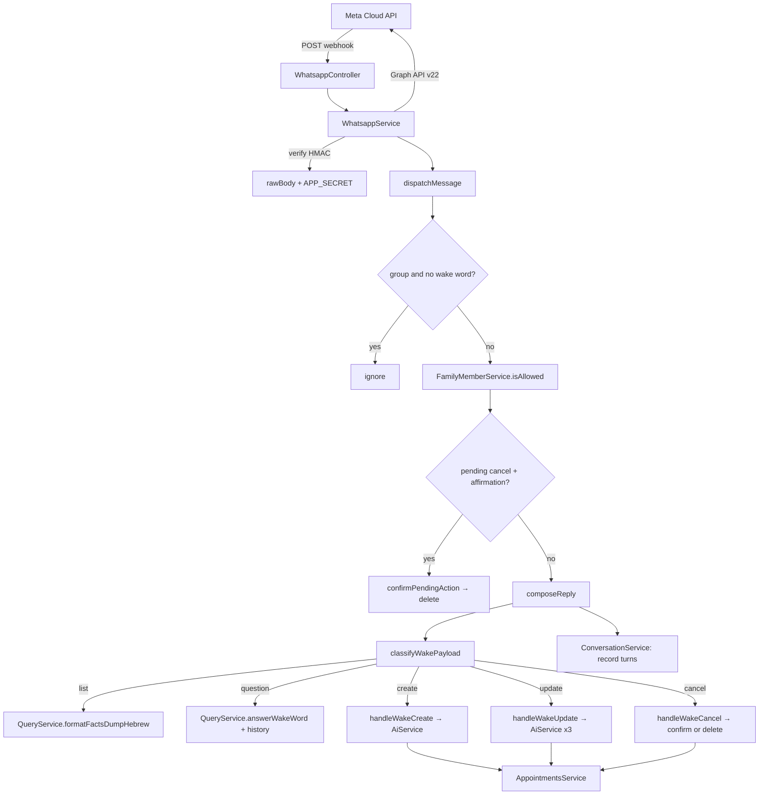
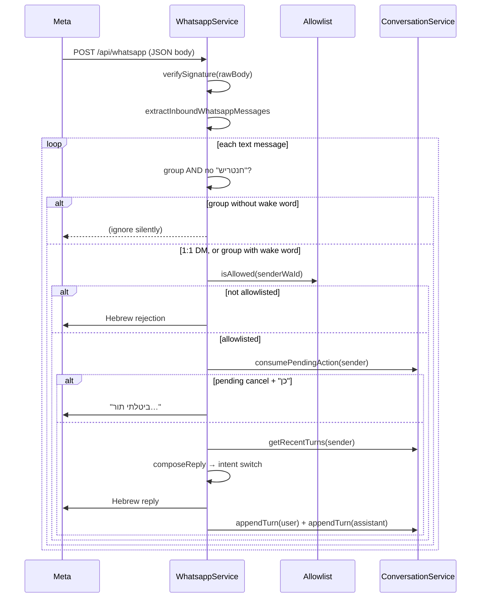

# Stage 4 — WhatsApp as “just another interface”

WhatsApp isn’t a separate product—it’s **the same brain** as the REST API, with a thinner adapter: parse Meta’s webhook, decide intent, call existing services, reply in short Hebrew.

This note focuses on **end-to-end message flow**, how it connects to **Stage 3 AI**, and the **security gates** before any bot logic runs.

## The backend story: a webhook adapter over the same services

The easiest way to reason about Stage 4 is to treat WhatsApp as just another “client”:

- The **web app** calls `/api/...` with a JWT.
- WhatsApp calls **one webhook** (`/api/whatsapp`) with Meta’s JSON payload.

After that, everything happens inside your backend:

- verify signature (optional but recommended),
- check sender is on the family roster,
- parse intent (list / question / create / update / cancel),
- call the same services you already trust (`AppointmentsService`, `QueryService`, `AiService`),
- send a short Hebrew reply back through Meta Graph API.

### Stage 4 routes (what Meta calls)

- **`GET /api/whatsapp`** — verification handshake (Meta checks your token)
- **`POST /api/whatsapp`** — inbound messages (Meta → your server)

Both are implemented in `src/whatsapp/whatsapp.controller.ts` and forwarded to `src/whatsapp/whatsapp.service.ts`.

---

## Architecture at a glance



**Imports in `WhatsappModule`:** `AiModule`, `QueryModule`, `AppointmentsModule`, `RequirementsModule`, `ConversationModule` — business rules stay in those services; WhatsApp is orchestration only. (`FamilyMemberService` / `FamilyPersonaService` come from the global `PhoneAllowlistModule`.)

---

## Inbound pipeline (every message)



Entry point in code (gate by **chat type**, then allowlist, then pending-confirmation, then compose):

```140:194:src/whatsapp/whatsapp.service.ts
  private async dispatchMessage(message: {
    text: string;
    senderWaId: string;
    replyTo: WhatsappSendTarget;
  }) {
    const text = message.text.trim();
    if (!text) return;

    const hadWakeWord = containsWakeWord(text);
    // In group chats the bot must be called by name; in 1:1 DMs every message is for it.
    if (message.replyTo.type === 'group' && !hadWakeWord) return;

    if (!(await this.familyMembers.isAllowed(message.senderWaId))) {
      await this.safeSend(message.replyTo, PHONE_NOT_ON_ALLOWLIST_HE);
      return;
    }
    const replyOpts = await this.patientReplyOptions(message.senderWaId);

    const pending = await this.conversation.consumePendingAction(message.senderWaId);
    if (pending && isAffirmation(text)) {
      const reply = await this.confirmPendingAction(pending, replyOpts);
      await this.safeSend(message.replyTo, reply);
      await this.recordTurns(message.senderWaId, text, reply);
      return;
    }

    const history = await this.conversation.getRecentTurns(message.senderWaId, { limit: 10 });
    const reply = await this.composeReply(text, message.senderWaId, replyOpts, hadWakeWord, history);
    if (reply) {
      await this.safeSend(message.replyTo, reply);
      await this.recordTurns(message.senderWaId, text, reply);
    }
  }
```

**Wake word, gated by chat type:** the wake word `חנטריש` (`BOT_WAKE_WORD`) is only **required in group chats**, where the bot must not reply to every family message. In a **1:1 DM** every message is obviously for the bot, so no wake word is needed — it reads `message.replyTo.type`. `stripWakeWord` still runs when the word is present, so `חנטריש` mid-sentence in a DM is harmless.

---

## Intent routing (after stripping the wake word)

`classifyWakePayload` in `whatsapp-wake-intent.ts` uses **Hebrew regex heuristics** (not a second ML model):

```110:131:src/whatsapp/whatsapp-wake-intent.ts
export function classifyWakePayload(payload: string): WakeIntent {
  if (!payload) {
    return 'list';
  }
  if (CANCEL_RE.test(payload)) {
    return 'cancel';
  }
  if (looksLikeNewAppointment(payload)) {
    return 'create';
  }
  if (looksLikeAppointmentUpdate(payload)) {
    return 'update';
  }
  if (looksLikeQuestion(payload)) {
    return 'question';
  }
  if (DATE_HINT_RE.test(payload)) {
    return 'create';
  }
  return 'question';
}
```

| Intent | Example (DM, or group + `חנטריש`) | Services used | LLM calls |
|--------|----------------------------|---------------|-----------|
| **list** | `חנטריש` alone / "מה התורים?" | `QueryService.buildUpcomingFactsPayload` + `formatFactsDumpHebrew` | **0** |
| **question** | `מתי התור הבא?` | `QueryService.answerWakeWord(text, replyOpts, history)` | 1 (grounded Q&A, with history) |
| **create** | `לאבא יש תור ב-27.5…` | `AiService.extractAppointmentFromText` → `AppointmentsService.create` | 1 (extract) |
| **update** | `תעדכן שהתור ב-30.7 בשעה 9:30` | See [Stage 3 update walkthrough](stage-3-ai-extraction-and-queries.md#walkthrough-3--update-flow-whatsapp-only-richest-ai-path) | up to **3** |
| **cancel** | `תבטל את התור ב-27.5` | Extract date → match appointment → **confirm then delete** | 1 (date via extract) |

`composeReply` is the single intent switch; it returns a Hebrew string (or `null`) that `dispatchMessage` sends and records:

```240:266:src/whatsapp/whatsapp.service.ts
  private async composeReply(
    text: string,
    senderWaId: string,
    replyOpts: PatientReplyOptions,
    hadWakeWord: boolean,
    history: ConversationTurnDto[],
  ): Promise<string | null> {
    const payload = stripWakeWord(text);
    const intent = classifyWakePayload(payload);
    switch (intent) {
      case 'list':
        return this.query.formatFactsDumpHebrew(
          await this.query.buildUpcomingFactsPayload(), replyOpts);
      case 'question':
        return this.query.answerWakeWord(text, replyOpts, history);
      case 'cancel':
        return this.handleWakeCancel(payload, replyOpts, hadWakeWord, senderWaId);
      // create, update ...
    }
  }
```

**Cancel safety:** when no wake word was used (a 1:1 DM), `handleWakeCancel` does **not** delete immediately — it stores a `PendingAction` via `ConversationService.setPendingAction` and replies with a gender-neutral confirmation (`"…האם לבטל את התור?"`). The next message answering `כן`/`אוקיי` (matched by `isAffirmation`) triggers `confirmPendingAction`, which performs the delete. Create/update are non-destructive and proceed directly.

---

## What we built (checklist)

- **`GET /api/whatsapp`** — Meta verification; `hub.verify_token` must match **`WHATSAPP_VERIFY_TOKEN`**.
- **`POST /api/whatsapp`** — inbound Cloud API payloads; **HMAC** on `X-Hub-Signature-256` when **`WHATSAPP_APP_SECRET`** is set. Nest boots with **`rawBody: true`** so signature verification uses raw bytes.
- **Allowlist gate** — sender must be in `FamilyMember` / `ALLOWED_PHONE_NUMBERS` env. No web registration required for WhatsApp (family can message once their phone is on the roster).
- **Full CRUD-style intents** — create, update (with appointment matching), cancel, list, Q&A—not “always create” anymore.
- **Chat-type wake-word gating** — 1:1 DMs respond to every message; group chats still require `חנטריש`.
- **Destructive-action confirmation** — cancel/delete in a DM asks `"האם לבטל…?"` first and only deletes after an affirmation (`PendingAction`).
- **Conversation memory** — recent turns per sender (`ConversationService`) are threaded into Q&A so follow-ups like "ומה עם הבא?" work.
- **Personalized replies** — answers address the sender by name with correct gendered Hebrew, derived from their `FamilyMember` row.
- **Outbound** — Graph API **`v22.0`** when tokens are set; otherwise log `[WhatsApp לא מוגדר]` for local dev.
- **1:1 family bot** — each allowlisted member messages the business number privately (no wake word needed). Groups API was not used; see [WhatsApp Groups (unused)](whatsapp-groups-setup.md).

---

## Security: who can talk to the bot?

Meta does **not** provide a production “allowed phones” list for your business number. Access control is **in our app**:

| Layer | Where | What |
|-------|--------|------|
| Allowlist | `FamilyMemberService` | `ALLOWED_PHONE_NUMBERS` env **or** `FamilyMember` table |
| Wake word | `dispatchMessage` | Required **only in group chats**; 1:1 DMs respond without it |
| Confirmation | `ConversationService` | Destructive cancel/delete requires an explicit `כן` first |

**Web app** still requires allowlist **and** **הרשמה** (password). WhatsApp only checks the allowlist.

---

## Example family messages

In a 1:1 DM the wake word is optional (shown here without it):

```text
מה התורים?
→ lists upcoming appointments + open requirements (no AI cost)

מתי התור הבא?
→ grounded answer from DB facts, personalized ("שירי, התור הבא…")

ומה עם זה שאחריו?
→ follow-up understood from conversation history

לאבא יש תור ב-27.5 בביקורת קרדיו באיכילוב
→ creates row; notes filtered for hallucinations

תוסיף שעדי תלווה
→ update path: merge notes on matched appointment

תבטל את התור ב-27.5
→ "מצאתי תור… האם לבטל?"  →  (reply) כן  →  "ביטלתי תור…"
```

In a **group** chat each of these must start with `חנטריש`.

---

## Challenges (mostly outside the repo)

- **Meta’s UI and business rules** change often; phone registration, business verification, and token issuance can block you even when Nest code is fine. See [Meta / WhatsApp developer setup](meta-whatsapp-developer-setup.md).
- **Groups API (error 131215)** — not all numbers can create API groups yet; family workaround is **private 1:1** messages to the business number with `חנטריש`.
- **Signature + JSON parsing** — frameworks sometimes eat the raw body; we keep `rawBody` explicitly for HMAC.

---

## Why these choices

| Choice | Instead of… | Because |
|--------|-------------|---------|
| Reuse `AppointmentsService`, `QueryService`, `AiService` | Duplicate rules in WhatsApp | One source of truth |
| Regex intent router | Second ML classifier | Good enough for family Hebrew; debuggable |
| Wake word in groups only | Wake word on every message | Natural 1:1 chat; still polite in family groups |
| Confirm before destructive cancel | Delete on first message | Cheap safety net once the wake word isn't a guard |
| Lightweight Prisma conversation memory | LangChain / external store | Follow-ups work without bloating Postgres (TTL + cron prune) |
| Log-only mode without tokens | Hard fail | Develop DB + AI before Meta paperwork |

---

## What’s still optional / future

- Inbound **images** → `MedicalDocument` (model exists; WhatsApp media download not fully wired).
- **Groups** — blocked on Meta eligibility; code path is ready when OBA enables it.

---

*Previous: [Stage 3 — AI](stage-3-ai-extraction-and-queries.md) · Next: [Docker & local DB](docker-and-local-database.md)*
